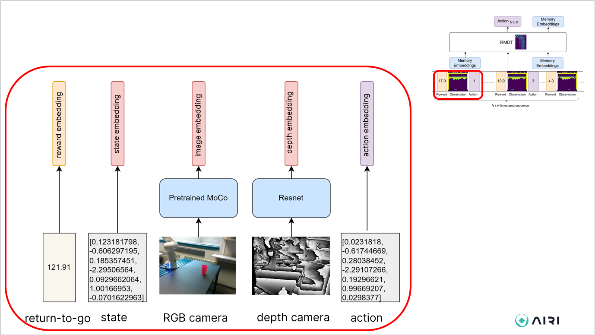

# Repository for TOTO benchmark solution
<!-- TODO: add teaser figures, some setup/task images, etc  -->


## Prerequisites
- [Mamba](https://mamba.readthedocs.io/en/latest/installation.html)

## Installation
You can either use a local conda environment or a docker environment.

### Setup conda environment
1. Run the following command to create a new conda environment: ```source setup_toto_env.sh```

### Setup docker environment
1. Follow the instructions in [here](https://github.com/AGI-Labs/toto_benchmark/blob/main/docker/README.md).

Note: If you are contributing models to TOTO, we strongly suggest setting up the docker environment.

### TOTO Datasets
<!-- TODO: need to update the dataset link after google drive clean up -->
TOTO consists of two tabletop manipulations tasks, scooping and pouring. The datasets of the two tasks can be downloaded [here](https://drive.google.com/drive/folders/1JGPGjCqUP4nUOAxY3Fpx3PjUQ_loo7fc?usp=share_link).

*Update*: please download the scooping data from Google Cloud Bucket [here](https://console.cloud.google.com/storage/browser/toto-dataset) instead.

<!-- TODO: update link to dataset README.md file. May consider create a dataset/ folder and add the readme into the repo -->
We release the following datasets: 
- `cloud-dataset-scooping.zip`: TOTO scooping dataset
- `cloud-dataset-pouring.zip`: TOTO pouring dataset

Additional Info:
- `scooping_parsed_with_embeddings_moco_conv5.pkl`: the same scooping dataset parsed with MOCO (Ours) pre-trained visual representations. (included as part of the TOTO scooping dataset) 
- `pouring_parsed_with_embeddings_moco_conv5.pkl`: the same pouring dataset parsed with MOCO (Ours) pre-trained visual representations. 
(included as part of the TOTO pouring dataset)

For more detailed dataset format information, see `assets/README.md`

## Solutions

We present 3 models:
- Decision Transformer
- Recurrent Memory Decision Transformer
- Masked Transformer Model

### DT

### RMDT

[RMDT](https://arxiv.org/pdf/2306.09459.pdf) is based on [DT](https://arxiv.org/pdf/2106.01345.pdf), but it has additional memory tokens as described in [RMT](https://arxiv.org/pdf/2207.06881.pdf) to process long sequences.



Here's an example command to train RMDT on pouring dataset with precomputed embeddings for RGB images by pretrained MOCO as the image encoder. To add depth images set `cameras: ["cam0d"]` in config.

```
python toto_benchmark/scripts/train.py --config-name train_rmt_d.yaml data.pickle_fn=assets/cloud-data-pooring/pooring_parsed_with_embeddings_moco_conv5_robocloud.pkl
```

Here's an example command to test RMDT in a dummy environement.

```
python toto_benchmark/scripts/test_stub_env.py -f=toto_benchmark/outputs/collaborator_agent
```

### MTM